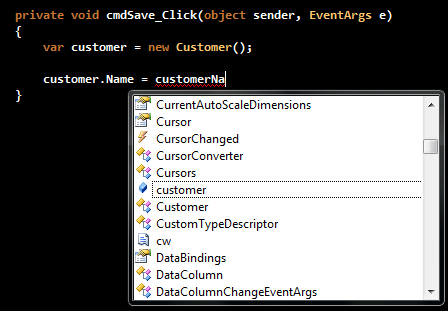

For my first real post I thought I would expand on an answer I gave to a question on StackOverflow [here][1].

The question was asking about naming conventions for winforms and webforms controls.  My take on this is that there’s no need to embed too much type information in the control’s name, e.g. `txtCustomerName`, `comboOrderStatus` (hungarian notation isn’t generally used for variable names any more, so why use it for control names?).  It is, however, useful to distinguish controls from variables that might be holding the same information, you don’t want ambiguity between `customerName` (the textbox) and `customerName` (the string variable).

I tend to name my form controls with a description of the information they contain (or function they perform, in the case of buttons) with a very broad control type descriptor appended to it.  Some examples:
`customerNameInput` (textbox)
`savebutton`, `cancelButton` (button, link button, image button etc)
`orderStatusSelector` (combo box, radio button list, etc)

The advantages to this are twofold.  First, I can change the exact type of a control without affecting it’s name.  Why should my form code care whether Order Status is selected with a combo box or a radio button list?  Or whether the Save button is a link button or a regular button?

The second, less obvious, advantage is having predictable control names.  When you’ve spent as much time as I have maintaining hellish 10,000 line `MainForm.cs` classes with so many controls that you can’t even load the designer, you really appreciate being able to guess the name of the Order Status dropdown without having to try various permutations of `drop`, `ddl`, `combo`, `list` prefixes.

[1]: http://stackoverflow.com/questions/642759/naming-convention-for-controls/642818#642818
