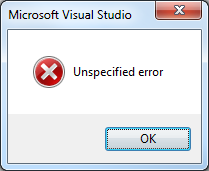

I’ve been doing battle with the LINQ to SQL designer for a while now so I was surprised to be caught out by this, frankly, unbelievable issue.  Putting together some example code for my next post, I had a .dbml file with around 4 classes, and suddenly the designer began throwing up a very unhelpful ‘Unspecified Error' every time I tried to make any changes.



Eventually I realised that every time I saved the diagram, the .designer.cs file was being deleted!


A bit of googling turned up the solution [here][1], I had added some code to the auto-generated partial class file (Data.cs), and foolishly didn’t realise that any ‘using’ statements in that file have to go inside the namespace declaration!

Wrong:

```cs
namespace GraphVizDebugging
{
  using System;

  partial class Predicate
```

Right:

```cs
namespace GraphVizDebugging
{
  using System;

  partial class Predicate
```

[1]: http://smehrozalam.wordpress.com/2009/10/05/linq-to-sql-visual-studio-designer-failed-to-autogenerate-designer-cs-data-classes/