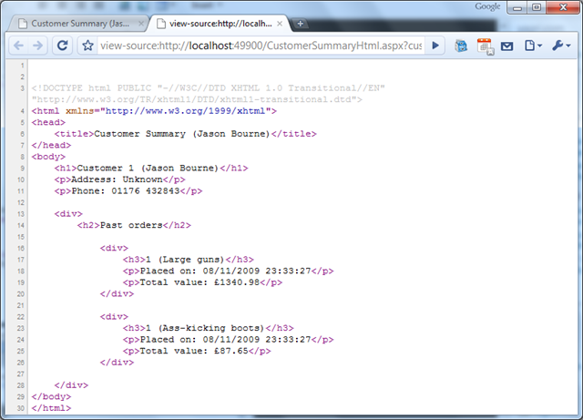
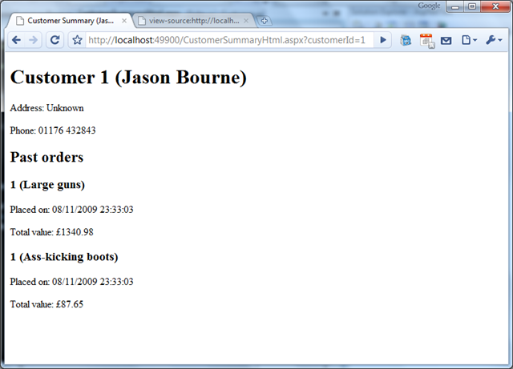
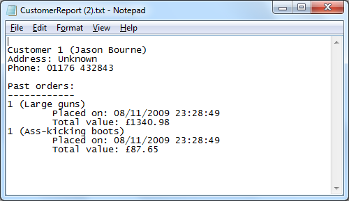

We had a user story at work recently which required a simple summary report page to be created, for viewing inside a JavaScript popup, and also to be downloadable as a text file.  We decided to create a new ASPX page, not using the normal master page so there was no visual chrome, just the report itself.  It was easy to create a popup containing an iframe to display the report itself, and this kept the report logic from cluttering up the main page.

As the report page was read-only, and quite simple, I opted not to use server controls, in line with my growing dislike of the whole [abstraction wrapped in deception covered in lie sauce][1] issue around webforms.  I wrote a simple code behind class to grab the input parameter from the query string, pull the relevant data from the repositories, and expose the data using a protected property on the page.

```cs
public class CustomerSummaryPage : Page
{
  protected Customer Customer { get; private set; }

  protected override void OnLoad(EventArgs e)
  {
    // Don't need viewstate as we have no server controls
    // and aren't even submitting any data back
    EnableViewState = false;

    // In production, more robust input parsing required!
    int customerId = int.Parse(Request.QueryString["customerId"]);

    // Expose the data to the view
    Customer = new Repository().GetCustomerById(customerId);
  }
}
```

Then the .aspx file uses clean markup with embedded server tags to render a simple summary report:

```xml
<%@ Page Language="C#" Inherits="AspNetText.CustomerSummaryPage" %>
<html>
<head>
  <title>Customer Summary</title>
</head>
<body>
  <h1>Customer <%= Customer.Id %> (<%= Customer.Name %>)</h1>
  <p>Address: <%= Customer.Address %></p>
  <p>Phone: <%= Customer.PhoneNumber %></p>

  <div>
    <h2>Past orders</h2>
    <% foreach (var order in Customer.PastOrders) { %>
      <div>
        <h3><%= order.Id %> (<%= order.Ref %>)</h3>
        <p>Placed on: <%= order.Placed %></p>
        <p>Total value: £<%= order.TotalValue %></p>
      </div>
    <% } %>
  </div>
</body>
</html>
```

Notice how clean this looks compared to a normal ASP.NET page covered in server controls, it’s more like an MVC view.  When we load this page up and check the source, the goodness continues:



The page itself is unremarkable, but easily styled and displayed within a popup iframe somewhere:



The interesting bit starts when we look at fulfilling the text-file export part of the requirement.  There are many different ways we can build up a text string, maybe override the ToString() method of each class to build up a nice description, or use the visitor pattern to populate a StringBuilder, among other ideas.  As much as I like the visitor pattern, it’s not entirely obvious to the uninitiated, and as we’re creating text for human consumption it would be nice not to have all our formatting bits and pieces buried in code.

If you think about it, ASP.NET is really just a fancy text templating system, taking our .aspx files, and at runtime replacing our server tags with real values, although this aspect is hard to appreciate when you’re looking at a page loaded with DataGrids and hidden ViewState fields...  The point being that we’re not tied to rendering HTML, we can use this power to render whatever we want, and with a few hints to the browser as to what we’re sending it, we can get a real quick-and-easy text report for our users:

```xml
<%@ Page Language="C#" Inherits="AspNetText.CustomerSummaryPage" %>
<% Response.ContentType = "text/plain"; %>
<% Response.AddHeader("Content-Disposition", "attachment;filename=CustomerReport.txt"); %>
Customer <%= Customer.Id %> (<%= Customer.Name %>)
Address: <%= Customer.Address %>
Phone: <%= Customer.PhoneNumber %>

Past orders:
------------
<% foreach (var order in Customer.PastOrders) { %>
  <%= order.Id %> (<%= order.Ref %>)
  Placed on: <%= order.Placed %>
  Total value: £<%= order.TotalValue %>
<% } %>
```

Notice how this page uses the exact same codebehind class as the other report, so our validation and data access code is centralised for both.  Here’s how the text report looks:



It’s worth noting a few issues with this approach.  Any code you put in the page (.asmx) file within server tags won’t get compiled until runtime so there is potential for some bugs to slip in if you’re not doing anything to smoke-test pages before deployment.  Running the site through the ASP.NET precompiler as part of your build process is a great way to catch issues like this before your users do.

Also it turned out to be tricky to get the whitespace in the report just right, and when it was, the markup wasn’t quite so clean, as we had to lose some of the indentation there.  Potentially you could intercept the response before it gets sent back to the client and do some post-processing to remove any whitespace except that which you explicitly add within a server tag.

Although you’d quickly run into limitations if you pushed this too far, and it is a bit unusual to use ASP.NET like this, it’s comforting to know that anyone familiar with ASP.NET markup (i.e. everyone on the team) could immediately dive in and fix bugs or enhance this report without needing to get familiar with any other code.

[1]: http://codebetter.com/blogs/rob.conery/archive/2009/04/22/i-spose-i-ll-just-say-it-you-should-learn-mvc.aspx
