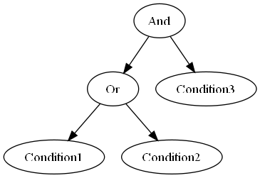
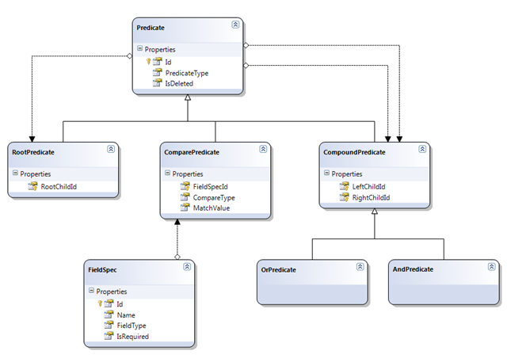

Whenever I’m trying to solve a particularly complex problem, I immediately reach for a sheet of paper and start making drawings to help wrap my head around it.  I often find myself tits-deep in piles of shabby diagrams scribbled on the back of envelopes and napkins.  I'd bet that most developers are the same.  But what do you do when faced with something big or complex enough that you can’t even manage to get it onto paper?  Rewrite your software so it’s not quite so ridiculously complicated?  In a perfect world, maybe, but another option is to bring out the heavy tools and write some code to do the visualising for you.  In this post I’ll look at how we can use a powerful free graphing library to easily produce diagrams of complex data structures.

The examples here are contrived, but directly inspired by a real-world problem I spent many hours trying to debug.  The last project I worked on had a decision system which allowed administrators to define complex criteria which could be used to filter applicants (this was a job recruitment system).  Each decision was stored as a tree of predicates, something like this:

    Root
    +---And
        +---Or
        |   +---Condition1
        |   +---Condition2
        +---Condition3

We also used soft-deletes (mostly so we didn’t have to make the UI smart enough to handle tree deletion), all the non-leaf predicate types knew to ignore a child with the ‘deleted’ bit set (i.e. an ‘And’ predicate will always treat a deleted child as true, an ‘Or’ predicate will treat it as false).  Certain types of predicate store references to dynamically-specified fields on the applicant, so that actual vs. expected values can be compared.

The UI did a great job of presenting a simple view to the user, it flattened the tree into groups of required conditions, and grouped those into optional sets, while hiding anything that had been deleted.  Unfortunately that made it difficult to get an idea of what the tree really looked like.  The database table for a simple decision looked something like this:

[](table.png)

What you’re seeing is guid identifiers, single-table inheritance, and self-referential foreign keys.  How much fun would you have walking through that decision tree by following the child id’s and checking deleted flags?  Now consider that this decision is _tiny_, and it’s the _only one_ in that table, and you might start to see why I went to the trouble of writing a tool to help me when one of our users reported that a particularly complex decision was filtering applicants incorrectly.

Drawing out a tree by hand at this scale is slow, error-prone, and just soul destroying.  Enter [GraphViz](http://www.graphviz.org), a library of tools for creating complex graphs from simple text markup.  Of particular interest is dot, a command line tool that takes input such as this:

    digraph G {
        And -> Or;
        Or -> Condition1;
        Or -> Condition2;
        And -> Condition3;
    }

And turns it into a directed graph like this:



You can see it would be fairly trivial to hack together a program to generate dot markup representing our decision tree, and have dot render it into something that we can actually comprehend.

We’ll start by setting up some LINQ to SQL classes:

[](classes.png)

When I wrote this for real I went for the quick-and-dirty method and churned out a horrendous piece of code full of massive switch statements and other awful things that I’m ashamed to admit.  Thankfully that solution was accidentally deleted and will never see the light of day.  For this post I decided to make things a bit nicer, so I’m using the [Visitor pattern](http://en.wikipedia.org/wiki/Visitor_pattern), it’s overkill for a simple tool but this is a good example of how it helps you use the power of polymorphism without bloating your classes with extra methods that would make them less cohesive.

In my case, the actual predicate classes already used the Visitor pattern so in theory I could simply have referenced the core assembly and passed in a new Visitor implementation, making things even easier.  In practice there was something of a dependency nightmare so it wasn’t an option.  Here’s the interface and some of the code I had to add to the domain classes:

```cs
public interface IPredicateVisitor
{
  void Visit(RootPredicate predicate);
  void Visit(AndPredicate predicate);
  void Visit(OrPredicate predicate);
  void Visit(ComparePredicate predicate);
}
```

```cs
partial class Predicate
{
  public abstract void Accept(IPredicateVisitor visitor);
}

partial class RootPredicate
{
  public override void Accept(IPredicateVisitor visitor)
  {
    visitor.Visit(this);
  }
}

// Repeated for each non-abstract subclass
```

I won’t include the whole visitor implementation here (all the code is attached at the end of the post) but here is one method to illustrate the idea:

```cs
public void Visit(AndPredicate predicate)
{
  var thisId = ids.GetIdFor(predicate);
  var leftId = ids.GetIdFor(predicate.LeftChild);
  var rightId = ids.GetIdFor(predicate.RightChild);
  var extraStyling = predicate.IsDeleted ? ",color=gray" : string.Empty;

  writer.WriteLine("{0} [label=\"And\"{1}];", thisId, extraStyling);
  writer.WriteLine("{0} -> {1};", thisId, leftId);
  writer.WriteLine("{0} -> {1};", thisId, rightId);

  predicate.LeftChild.Accept(this);
  predicate.RightChild.Accept(this);
}
```

This writes 3 output lines.  The first sets the label and any styling for the graph node.  The next two link it to it’s left and right child.  Then we recurse into the left and then the right child.  I’m using an id converter class, which just contains a dictionary, to map the guid identifiers into something that GraphViz will accept (it chokes on guids, even with the hyphens removed).

To invoke our visitor, we wrap it in a very simple program:

```cs
static void Main(string[] args)
{
  Console.Error.WriteLine("Getting tree for predicate root id '{0}'", args[0]);
  Console.Error.WriteLine("Using connection string '{0}'", args[1]);

  var rootId = new Guid(args[0]);

  using (var context = new DataDataContext(args[1]))
  {
    var root = context.Predicates.Single(x => x.Id == rootId);

    var writer = new IndentedTextWriter(Console.Out);

    var visitor = new DotGraphPredicateVisitor(writer);
    root.Accept(visitor);
  }
}
```

The IndentedTextWriter is pure gold-plating by the way - dot markup ignores whitespace, but it makes it easier to verify the output if we need to.  We’re going to be piping the output from this program directly into dot, so we can’t write status or diagnostic messages directly to stdout (Console.Out).  We can print these to stderr (Console.Error) which will show up on screen but won’t get redirected.

If we run the program directly, passing in the id of our root predicate and a connection string, we can see the dot markup that gets produced:

    >TreeVisualiser.exe ^
        489501F4-F170-48A6-9FE1-180165A37F1B ^
        "Data Source=localhost\sql2008;Initial Catalog=GraphVizDebugging;Integrated Security=True"

    Getting tree for predicate root id '489501F4-F170-48A6-9FE1-180165A37F1B'
    Using connection string 'Data Source=localhost\sql2008;Initial Catalog=GraphVizDebugging;Integrated Security=True'
    digraph G {
        Root_1 [label="Root"];
        Root_1 -> And_2;
        And_2 [label="And"];
        And_2 -> And_3;
        And_2 -> Compare_4;
        And_3 [label="And"];
        And_3 -> And_5;
        And_3 -> Or_6;
        And_5 [label="And",color=gray];
        And_5 -> Compare_7;
        And_5 -> Compare_8;
        Compare_7 [label="Date of Birth is more than 21 years ago"];
        Compare_8 [label="Date of Birth is less than 65 years ago"];
        Or_6 [label="Or"];
        Or_6 -> Compare_9;
        Or_6 -> Compare_10;
        Compare_9 [label="Location equals 'Reading, UK'"];
        Compare_10 [label="Willing to Relocate is true"];
        Compare_4 [label="Years Experience is greater than 5"];
    }

That looks good, so we can change the command to pipe the output into dot, and redirect dot’s output to file:

    >TreeVisualiser.exe ^
        489501F4-F170-48A6-9FE1-180165A37F1B ^
        "Data Source=localhost\sql2008;Initial Catalog=GraphVizDebugging;Integrated Security=True" ^
        | dot -Tpng > out.png

Now if we open up out.png:

[](output.png)

Now that’s something I can print out a few copies of and attack with coloured markers, while I trace through exactly why the evaluation is failing.  The deleted nodes have a grey outline so we know they’re different, and it’s easy to add more conditional styling if we want to highlight certain things or differentiate between predicate types.

This might seem like a lot of work just to get a picture of what’s going on in a data structure, but I’m not kidding when I say that trying to draw the thing _just once_ took me longer than the entire time I spent writing the program.  And I got the drawing wrong.  And I re-used this several times as I tweaked the decision tree.  I say: it was worth it.

If you find yourself in a similar situation where you can’t figure out the internal state of something you’re debugging, consider hacking together something to help visualise it.  Tools like GraphViz make it simple to create detailed visuals, but even some well-formatted text output can be just as useful to help infer structure.  It takes less time than you might imagine, and can often save you hours of stress and hair-pulling.

[GraphViz download page](http://www.graphviz.org/Download..php)

[dot user guide](http://www.graphviz.org/pdf/dotguide.pdf)

[Example code from this post](code.zip)
